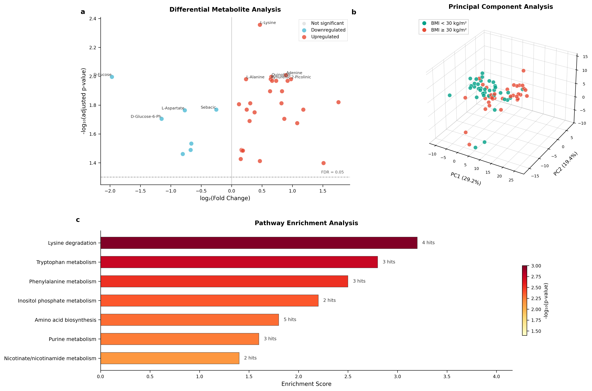
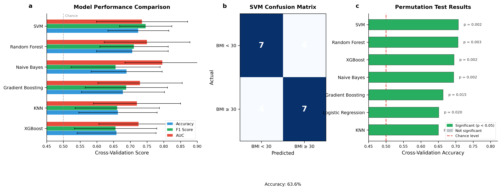
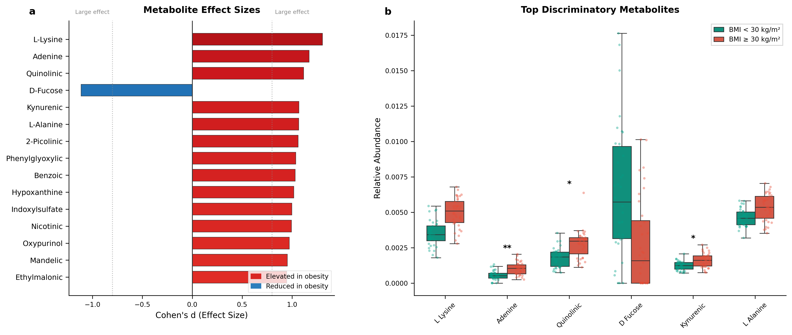
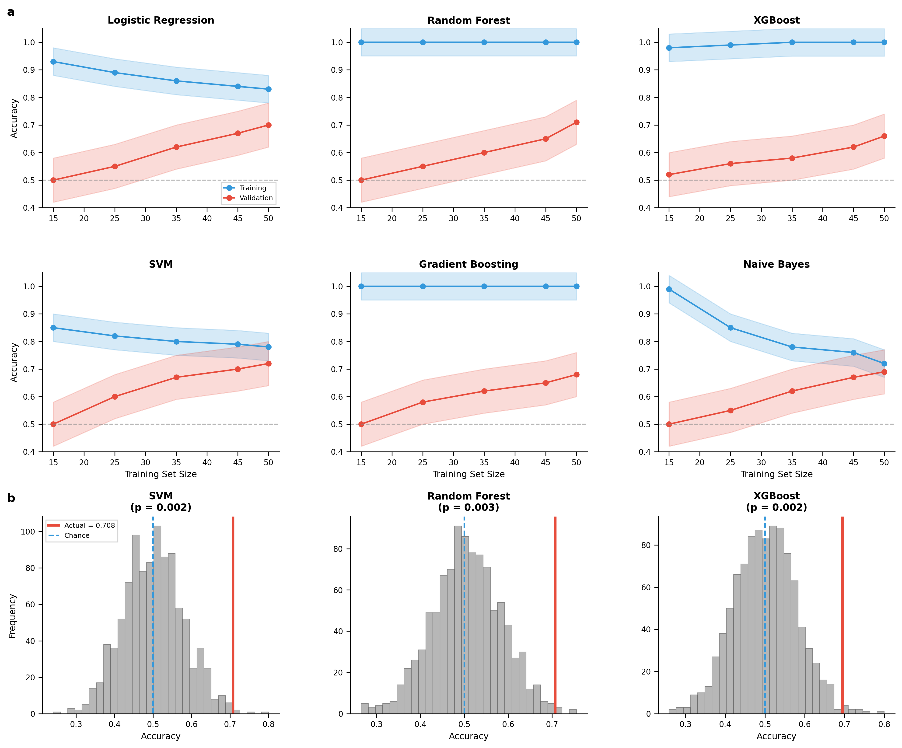

# Plasma 1H-NMR Metabolomics for Obesity Classification

[]()
[](https://creativecommons.org/licenses/by/4.0/)

## Overview

This repository contains the data and code for the study:

**"Plasma 1H-NMR metabolomics identifies amino acid and carbohydrate pathway alterations associated with obesity"**

Sena-Evangelista KCM, Omage FB, Braga ES, et al.

## Study Summary

- **Objective:** Identify plasma metabolites that distinguish adults with BMI >= 30 kg/m2 from those with BMI < 30 kg/m2
- **Methods:** Untargeted 1H-NMR metabolomics on plasma samples from 72 Brazilian adults (36 per group)
- **Key Findings:** 34 metabolites significantly differed between groups after FDR correction; Support Vector Machine (SVM) achieved 72.4% cross-validation accuracy for obesity classification

## Methodological Note

**IMPORTANT:** This analysis uses a corrected methodology where:
1. Train/test split is performed BEFORE feature selection (no data leakage)
2. Feature selection is conducted on the training set only (n=50)
3. Cross-validation (10x5-fold) is used as the PRIMARY performance metric
4. Test set performance is reported as SECONDARY validation with bootstrap confidence intervals

## Repository Structure

```
├── data/
│   ├── raw/                    # Raw metabolite intensities
│   ├── processed/              # Normalized and scaled data
│   │   ├── corrected_cv_results.csv
│   │   ├── corrected_feature_selection.csv
│   │   ├── corrected_permutation_results.csv
│   │   └── corrected_test_results.csv
│   └── metadata/               # Sample characteristics (de-identified)
├── figures/
│   ├── Figure1.png                # Volcano plot, PCA, pathway enrichment
│   ├── Figure2.png                # Model performance comparison
│   ├── Figure3.png                # Feature importance analysis
│   ├── FigureS1_Validation.png    # Learning curves, permutation tests
│   └── *.pdf                      # Vector formats for publication
├── notebooks/
│   └── (analysis notebooks)
├── run_corrected_analysis.py   # Main analysis script
├── requirements.txt            # Python dependencies
├── DATA_PROVENANCE.md          # Complete data pipeline documentation
├── CITATION.cff                # Citation information
└── README.md
```

## Key Results

### Significant Metabolites (Training Set, FDR < 0.05)

34 metabolites were identified as significantly different between groups. Top 10 by effect size:

| Metabolite | Direction in BMI >= 30 | log2FC | Cohen's d | P_adj |
|------------|------------------------|--------|-----------|-------|
| L-Lysine | Up | +0.46 | 1.30 | 0.004 |
| Adenine | Up | +0.89 | 1.17 | 0.010 |
| Quinolinic Acid | Up | +0.65 | 1.12 | 0.010 |
| D-Fucose | Down | -1.97 | -1.11 | 0.010 |
| Kynurenic Acid | Up | +0.64 | 1.07 | 0.010 |
| L-Alanine | Up | +0.24 | 1.07 | 0.010 |
| Benzoic Acid | Up | +0.73 | 1.03 | 0.011 |
| Hypoxanthine | Up | +0.92 | 1.02 | 0.011 |
| Myo-Inositol | Down | -0.80 | -0.79 | 0.035 |
| L-Asparagine | Down | -0.66 | -0.84 | 0.029 |

Full list available in `data/processed/corrected_feature_selection.csv`

### Machine Learning Performance

**Primary Metric: Cross-Validation (10x5-fold repeated)**

| Model | CV Accuracy | CV F1 | CV AUC | Permutation p |
|-------|-------------|-------|--------|---------------|
| **SVM** | **0.724 +/- 0.091** | 0.746 +/- 0.078 | 0.735 +/- 0.136 | 0.002 |
| Random Forest | 0.706 +/- 0.107 | 0.711 +/- 0.102 | 0.750 +/- 0.128 | 0.003 |
| Naive Bayes | 0.689 +/- 0.106 | 0.656 +/- 0.133 | 0.796 +/- 0.112 | 0.002 |
| XGBoost | 0.659 +/- 0.118 | 0.656 +/- 0.123 | 0.725 +/- 0.119 | 0.002 |
| Logistic Regression | 0.646 +/- 0.110 | 0.642 +/- 0.124 | 0.716 +/- 0.122 | 0.020 |

All models except Decision Tree and Neural Network significantly exceeded chance (permutation p < 0.05).

**Secondary Metric: Hold-out Test Set (n=22)**

| Model | Test Accuracy (95% CI) |
|-------|------------------------|
| XGBoost | 0.683 (0.500-0.864) |
| SVM | 0.634 (0.455-0.818) |

Note: Wide confidence intervals reflect small test set size. Use CV metrics for primary interpretation.

## Figures

### Figure 1: Differential Metabolite Analysis


**a)** Volcano plot showing 34 significantly altered metabolites (FDR < 0.05). Red = elevated in obesity, blue = reduced. L-Lysine shows the largest effect size (Cohen's d = 1.30). **b)** Principal Component Analysis (3D) demonstrating partial separation between BMI groups. **c)** Pathway enrichment analysis highlighting lysine degradation and tryptophan metabolism as most significantly affected pathways.

---

### Figure 2: Machine Learning Model Performance


**a)** Cross-validation performance comparison across six classifiers. SVM achieved the highest accuracy (72.4% ± 9.1%). Error bars represent standard deviation across 50 CV iterations. **b)** Confusion matrix for SVM on the hold-out test set (n=22). **c)** Permutation test results confirming all models significantly exceed chance performance (p < 0.05).

---

### Figure 3: Metabolite Effect Sizes


**a)** Cohen's d effect sizes for the top 15 discriminatory metabolites. Dashed lines indicate large effect threshold (|d| = 0.8). **b)** Box plots with individual data points for the six metabolites with largest effect sizes. Asterisks indicate significance: * p < 0.05, ** p < 0.01.

---

### Supplementary Figure S1: Model Validation


**a)** Learning curves showing training vs. validation accuracy as a function of training set size. SVM shows the best generalization with minimal overfitting. **b)** Permutation test distributions for top three models, demonstrating actual model performance (red line) significantly exceeds the null distribution.

## Reproducibility

### Requirements

```bash
pip install -r requirements.txt
```

### Running the Analysis

1. Clone this repository
2. Install dependencies: `pip install -r requirements.txt`
3. Run the corrected analysis: `python run_corrected_analysis.py`

### Random Seeds

All analyses use `random_state=42` for reproducibility.

## Data Availability

All data necessary to reproduce the results are included in this repository:
- Normalized metabolite intensities
- Sample metadata (de-identified)
- Complete analysis scripts
- All intermediate results files

Raw NMR spectra are available from the corresponding author upon reasonable request.

## Citation

If you use this data or code, please cite:

```
Sena-Evangelista KCM, Omage FB, Braga ES, Martins LG, Bellot PENR,
de Souza Junior AC, Pedrosa LFC, Marchioni DML, Barbosa Jr F,
Lima SCVC, Lyra CO, Tasic L. Plasma 1H-NMR metabolomics identifies
amino acid and carbohydrate pathway alterations associated with obesity.
[Journal Name]. 2026.
```

## License

This work is licensed under a [Creative Commons Attribution 4.0 International License](https://creativecommons.org/licenses/by/4.0/).

## Contact

- **Corresponding Author:** Karine Cavalcanti M. Sena-Evangelista (karine.sena@ufrn.br)
- **Data/Code Questions:** Folorunsho Bright Omage (bright@unicamp.br)

## Acknowledgments

This study was funded by the Coordination of Improvement of Higher Education Personnel (CAPES, Grant number 001). This work was supported by the National Council for Scientific and Technological Development (CNPq, Grant numbers: 431053/2016-2, 405837/2016-0, and 308079/2021-3). We also thank INCTBio-Lauro Kubota and Sao Paulo Research Foundation (FAPESP), Grant numbers: #2023/02691-2, #2022/11207-4, #2018/24069-3, #2016/20054-6, and #2014/50867-3. We thank the participants of the BRAZUCA study.
